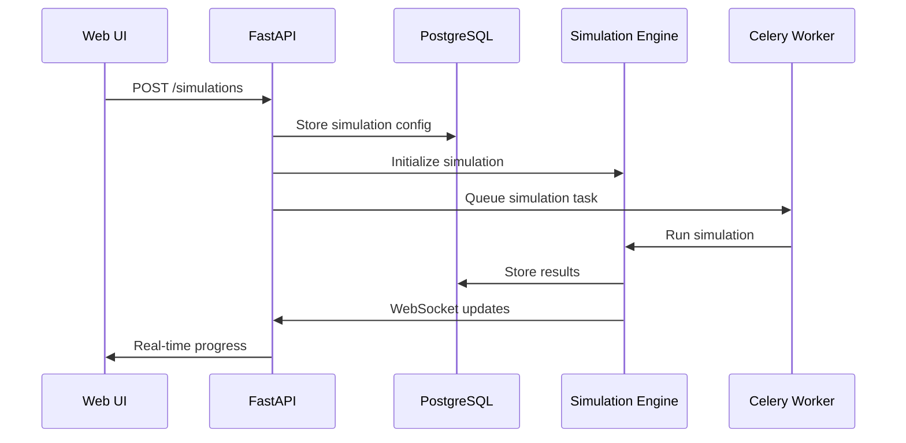
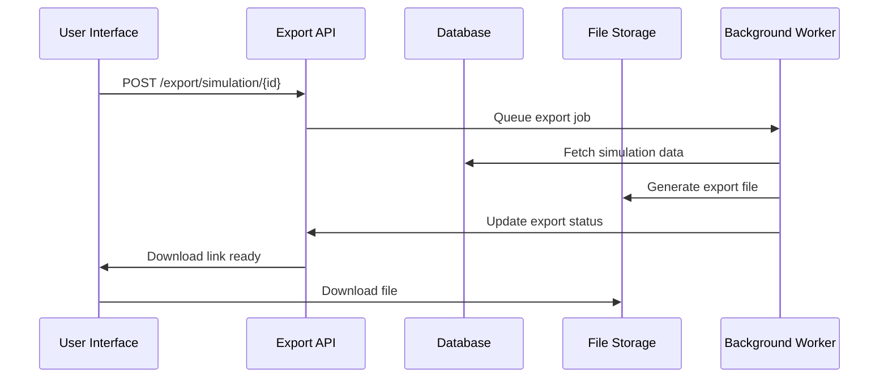

# IPE Architecture Overview

## System Architecture

IPE follows a layered microservices architecture designed for scalability, maintainability, and scientific rigor.

```
┌─────────────────────────────────────────────────────┐
│                Web Interface                        │
│            (React + TypeScript)                     │
├─────────────────────────────────────────────────────┤
│                 API Gateway                         │
│              (FastAPI + WebSocket)                  │
├─────────────────────────────────────────────────────┤
│              Core Services                          │
│  ┌─────────────┬─────────────┬─────────────────────┐ │
│  │ Simulation  │ Evolution   │ Analysis &          │ │
│  │ Engine      │ Algorithms  │ Visualization       │ │
│  └─────────────┴─────────────┴─────────────────────┘ │
├─────────────────────────────────────────────────────┤
│               Data Layer                            │
│  ┌──────────────────────┬──────────────────────────┐ │
│  │    PostgreSQL        │      Redis Cache         │ │
│  │  (Persistent Data)   │   (Session & Results)    │ │
│  └──────────────────────┴──────────────────────────┘ │
├─────────────────────────────────────────────────────┤
│             Infrastructure                          │
│        Docker + Kubernetes + Monitoring            │
└─────────────────────────────────────────────────────┘
```

## Core Modules

### 1. Simulation Engine (`ipe/simulation/`)
- Population management and lifecycle
- Generation advancement logic
- State space operations
- Environmental interaction models

### 2. Evolution Algorithms (`ipe/core/`)
- Genetic algorithms and selection mechanisms
- Mutation operators and variation generation
- Fitness calculation and ranking
- Phylogenetic tree construction

### 3. Game Theory Framework (`ipe/core/games/`)
- Resource allocation games
- Nash equilibrium solvers
- Strategy evolution dynamics
- Payoff matrix computations

### 4. Data Integration (`ipe/data/`)
- External data source connectors
- File format parsers (CSV, JSON, HDF5)
- Validation and quality control
- Batch processing utilities

### 5. Visualization (`ipe/visualization/`)
- 3D state space rendering
- Time series plotting
- Statistical chart generation
- Interactive dashboard components

### 6. API Layer (`ipe/api/`)
- REST endpoint definitions
- WebSocket real-time updates
- Authentication and authorization
- Request/response serialization

## Technology Stack

### Backend
- **Python 3.9+**: Core language
- **FastAPI**: REST API framework
- **SQLAlchemy**: ORM and database abstraction
- **Celery**: Asynchronous task processing
- **NumPy/SciPy**: Scientific computing
- **Matplotlib/Plotly**: Visualization

### Frontend
- **React 18+**: UI framework
- **TypeScript**: Type-safe JavaScript
- **Three.js**: 3D visualization
- **Material-UI**: Component library
- **Redux Toolkit**: State management

### Database
- **PostgreSQL 14+**: Primary data storage
- **Redis 6+**: Caching and session management
- **Alembic**: Database migrations

### Infrastructure
- **Docker**: Containerization
- **Docker Compose**: Local development
- **Nginx**: Reverse proxy and load balancing
- **Prometheus/Grafana**: Monitoring and alerting

## Data Flow

### Simulation Creation Flow


### Data Export Flow


## Key Design Patterns

### 1. Repository Pattern
```python
from abc import ABC, abstractmethod

class SimulationRepository(ABC):
    @abstractmethod
    async def create(self, simulation: Simulation) -> str:
        pass
    
    @abstractmethod
    async def get(self, sim_id: str) -> Simulation:
        pass

class PostgreSQLSimulationRepository(SimulationRepository):
    async def create(self, simulation: Simulation) -> str:
        # Implementation specific to PostgreSQL
        pass
```

### 2. Strategy Pattern for Algorithms
```python
class SelectionStrategy(ABC):
    @abstractmethod
    def select(self, population: Population, fitness: np.ndarray) -> Population:
        pass

class TournamentSelection(SelectionStrategy):
    def select(self, population: Population, fitness: np.ndarray) -> Population:
        # Tournament selection implementation
        pass

class RankSelection(SelectionStrategy):
    def select(self, population: Population, fitness: np.ndarray) -> Population:
        # Rank-based selection implementation
        pass
```

### 3. Observer Pattern for Real-time Updates
```python
class SimulationObserver(ABC):
    @abstractmethod
    async def update(self, event: SimulationEvent):
        pass

class WebSocketObserver(SimulationObserver):
    async def update(self, event: SimulationEvent):
        await self.websocket.send_json({
            "type": "simulation_update",
            "data": event.to_dict()
        })
```

### 4. Factory Pattern for Simulation Types
```python
class SimulationFactory:
    @staticmethod
    def create_simulation(sim_type: str, config: dict) -> Simulation:
        if sim_type == "altitude_adaptation":
            return AltitudeAdaptationSimulation(config)
        elif sim_type == "thermal_adaptation":
            return ThermalAdaptationSimulation(config)
        else:
            raise ValueError(f"Unknown simulation type: {sim_type}")
```

## Performance Considerations

### 1. Memory Management
- Use numpy arrays for large population data
- Implement memory pools for frequent allocations
- Monitor memory usage during long simulations
- Clear intermediate results periodically

### 2. CPU Optimization
- Vectorize operations using NumPy
- Use multiprocessing for parallel population updates
- Implement Numba JIT compilation for hot paths
- Profile performance bottlenecks regularly

### 3. Database Optimization
- Index frequently queried columns
- Use connection pooling
- Batch database operations
- Implement read replicas for analytics

### 4. Caching Strategy
- Cache simulation results in Redis
- Use ETags for API response caching
- Implement CDN for static assets
- Cache expensive computation results

## Security Architecture

### 1. Authentication & Authorization
```python
from fastapi import Depends, HTTPException, status
from fastapi.security import HTTPBearer

security = HTTPBearer()

async def get_current_user(token: str = Depends(security)) -> User:
    try:
        payload = jwt.decode(token.credentials, SECRET_KEY, algorithms=[ALGORITHM])
        user_id: str = payload.get("sub")
        if user_id is None:
            raise credentials_exception
    except JWTError:
        raise credentials_exception
    
    user = await get_user(user_id)
    if user is None:
        raise credentials_exception
    return user
```

### 2. Input Validation
```python
from pydantic import BaseModel, validator, Field

class SimulationRequest(BaseModel):
    name: str = Field(..., min_length=1, max_length=100)
    duration: int = Field(..., ge=1, le=10000)
    population_size: int = Field(..., ge=10, le=100000)
    mutation_rate: float = Field(..., ge=0.0, le=1.0)
    
    @validator('name')
    def name_must_be_alphanumeric(cls, v):
        if not v.replace(' ', '').replace('-', '').replace('_', '').isalnum():
            raise ValueError('Name must contain only alphanumeric characters')
        return v
```

### 3. Rate Limiting
```python
from slowapi import Limiter, _rate_limit_exceeded_handler
from slowapi.util import get_remote_address
from slowapi.errors import RateLimitExceeded

limiter = Limiter(key_func=get_remote_address)

@app.post("/simulations")
@limiter.limit("10/minute")
async def create_simulation(
    request: Request,
    simulation_request: SimulationRequest
):
    # Implementation
    pass
```

## Scalability Features

### 1. Horizontal Scaling
- Stateless API servers
- Database read replicas
- Redis clustering
- Load balancing with session affinity

### 2. Vertical Scaling
- CPU-intensive simulations
- Memory optimization for large populations
- GPU acceleration support
- SSD storage for performance

### 3. Microservices Architecture
```python
# Separate services for different concerns
services = {
    "simulation-engine": "Handles simulation execution",
    "data-processor": "Processes and validates data",
    "export-service": "Generates exports and reports",
    "notification-service": "Manages real-time updates",
    "auth-service": "Authentication and authorization"
}
```

## Monitoring and Observability

### 1. Logging
```python
import logging
import structlog

# Configure structured logging
logging.basicConfig(format="%(message)s", stream=sys.stdout, level=logging.INFO)
logger = structlog.get_logger()

async def create_simulation(request: SimulationRequest):
    logger.info(
        "simulation.created",
        simulation_id=sim_id,
        duration=request.duration,
        population_size=request.population_size,
        user_id=current_user.id
    )
```

### 2. Metrics
```python
from prometheus_client import Counter, Histogram, Gauge

# Define metrics
SIMULATION_COUNTER = Counter('simulations_created_total', 'Total simulations created')
SIMULATION_DURATION = Histogram('simulation_duration_seconds', 'Simulation execution time')
ACTIVE_SIMULATIONS = Gauge('active_simulations', 'Number of currently running simulations')

# Use in code
SIMULATION_COUNTER.inc()
with SIMULATION_DURATION.time():
    run_simulation()
ACTIVE_SIMULATIONS.set(get_active_count())
```

### 3. Health Checks
```python
@app.get("/health")
async def health_check():
    checks = {
        "database": await check_database_connection(),
        "redis": await check_redis_connection(),
        "disk_space": check_disk_space(),
        "memory": check_memory_usage()
    }
    
    all_healthy = all(checks.values())
    status_code = 200 if all_healthy else 503
    
    return Response(
        content=json.dumps(checks),
        status_code=status_code,
        media_type="application/json"
    )
```

## Testing Architecture

### 1. Unit Tests
```python
import pytest
from unittest.mock import Mock, patch

class TestSimulationEngine:
    @pytest.fixture
    def mock_population(self):
        return Mock(spec=Population)
    
    def test_selection_reduces_population_size(self, mock_population):
        engine = SimulationEngine()
        mock_population.__len__.return_value = 1000
        
        result = engine.select(mock_population, selection_pressure=0.5)
        
        assert len(result) == 500
```

### 2. Integration Tests
```python
import pytest
from httpx import AsyncClient

@pytest.mark.asyncio
async def test_simulation_workflow():
    async with AsyncClient(app=app, base_url="http://test") as client:
        # Create simulation
        response = await client.post("/api/v1/simulations", json={
            "name": "Test Simulation",
            "duration": 10
        })
        assert response.status_code == 201
        sim_id = response.json()["id"]
        
        # Check status
        response = await client.get(f"/api/v1/simulations/{sim_id}")
        assert response.status_code == 200
        assert response.json()["status"] == "created"
```

### 3. Load Tests
```python
import asyncio
from concurrent.futures import ThreadPoolExecutor

async def load_test_simulation_creation():
    """Test system under load"""
    async with AsyncClient(app=app) as client:
        tasks = []
        for i in range(100):
            task = client.post("/api/v1/simulations", json={
                "name": f"Load Test {i}",
                "duration": 50
            })
            tasks.append(task)
        
        responses = await asyncio.gather(*tasks)
        success_count = sum(1 for r in responses if r.status_code == 201)
        
        assert success_count >= 95  # 95% success rate under load
```

This architecture documentation provides a comprehensive overview of IPE's design principles, implementation patterns, and operational considerations for developers working with the system.